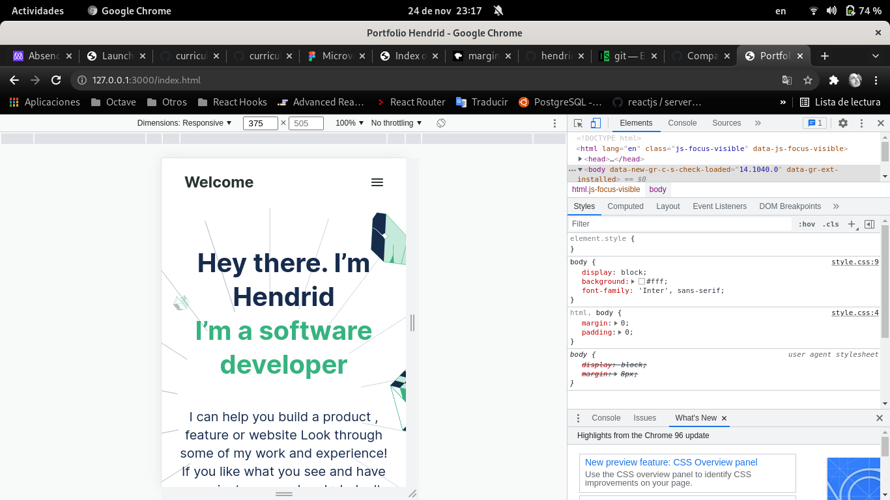
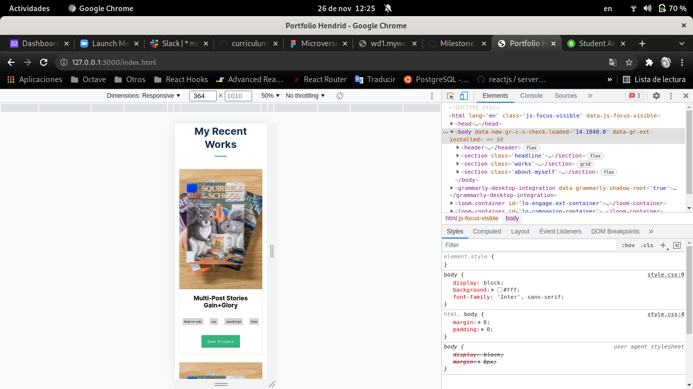
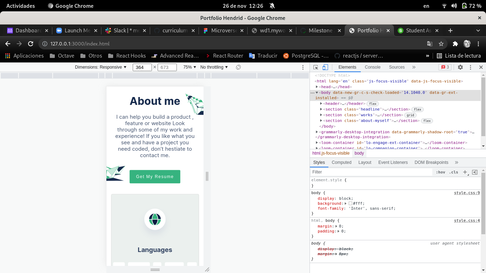
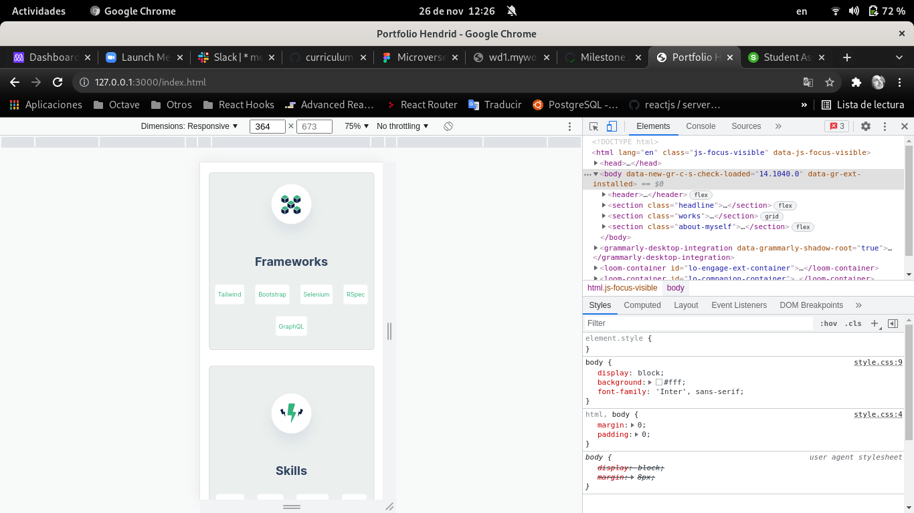

Portfolio to Microverse course

# Portfolio Microverse

> Professional Portfolio using HTML, CSS

## Built With

- HTML, CSS

## Getting Started

To get a local copy up follow these simple example steps.

### Prerequisites

- GIT

### Setup

Open a terminal or a git bash in the desired directory and run `https://github.com/hendridg/portfolio-microverse.git`

👤 **Author1**

- GitHub: [@hendridg](https://github.com/hendridg)
- Twitter: [@hendridg](https://twitter.com/hendridg)
- LinkedIn: [LinkedIn](https://linkedin.com/in/hendridg)

## 📝 License

This project is [MIT](./MIT.md) licensed.
